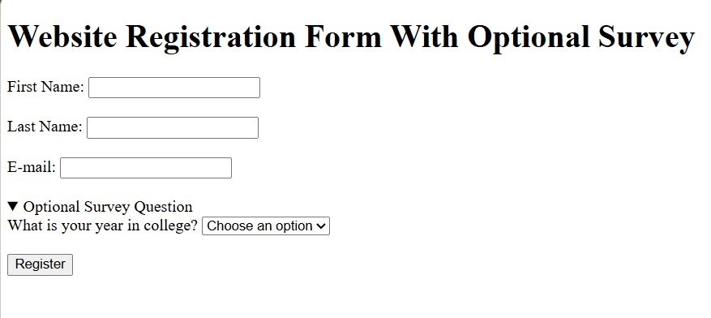
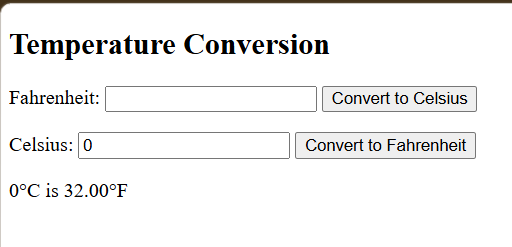
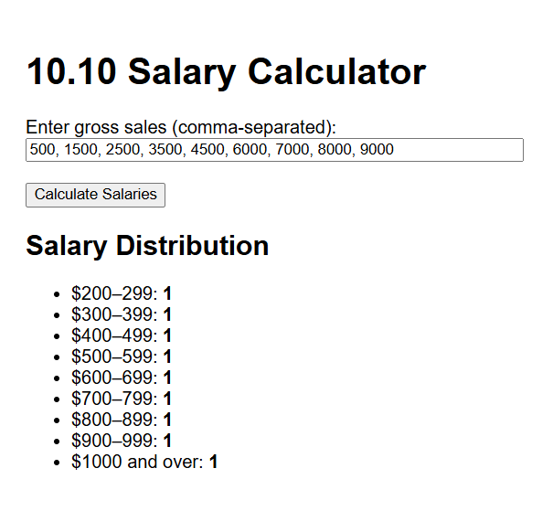
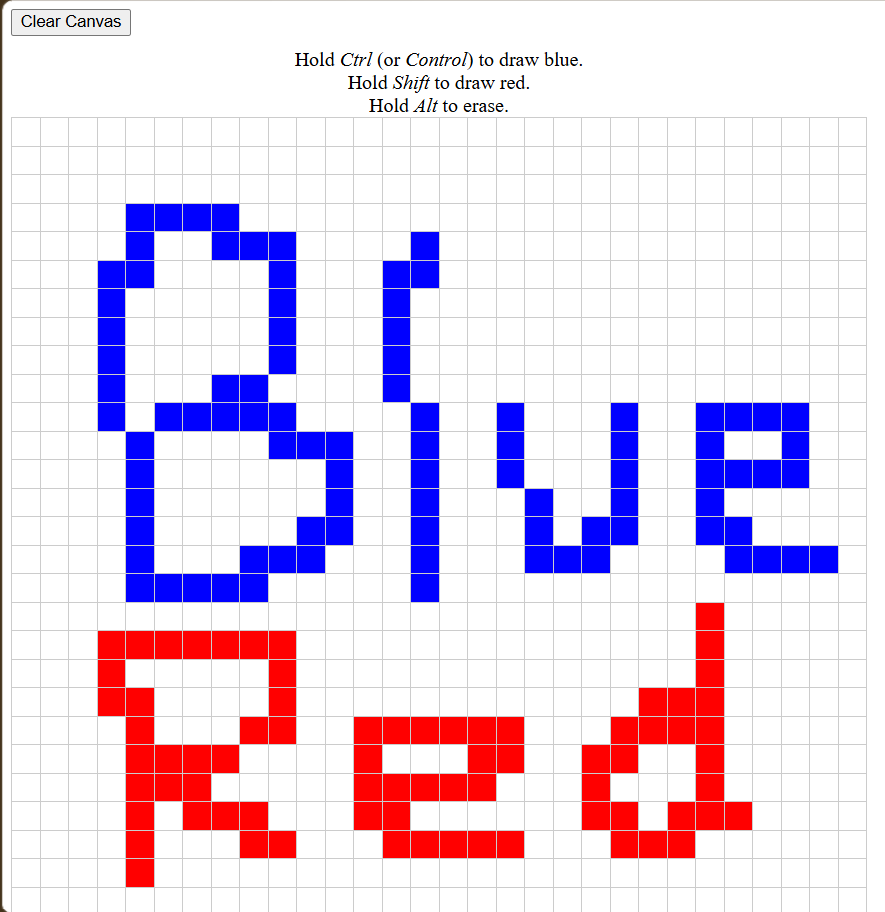
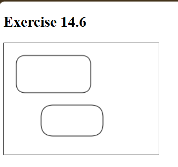
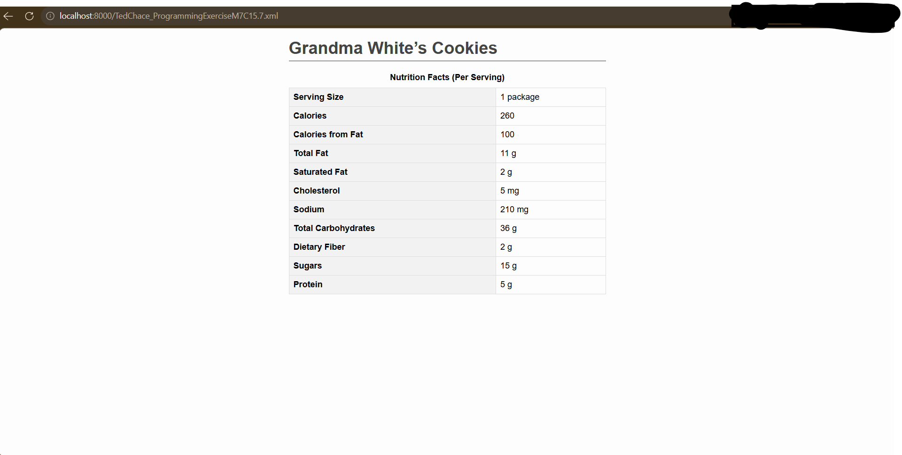

# Introduction to Internet Applications Programming Exercises

## Objectives

This project contains selected programming exercises completed throughout COM-340 Introduction to Internet Applications at Saint Leo University.

COM-340 was a hands-on, skill-based course focused on Internet application theory and the technologies used to develop web applications. The coursework progressed through HTML5, CSS, client-side JavaScript, DOM interaction, Canvas, XML and XSLT, relational database concepts and SQL, and introductory ASP.NET web development.

This repository documents the source files I completed across the course's eight modules and demonstrates the progression of my web programming and application-development fundamentals.

The original individual exercise instructions are no longer available, so exercise descriptions are based on the functionality and technologies demonstrated by the archived submissions rather than reconstructed assignment requirements.

Minor syntax and compatibility corrections were made when preparing hte archived coursework for public presentation; the original exercise logic and scope were preserved.

### Skills Learned

- Developed and structured webpages using HTML5.
- Applied CSS styling, positioning, box-model properties, and visual effects.
- Implemented browser-side programming logic with JavaScript.
- Processed user input using forms, validation, calculations, and conditional logic.
- Used arrays, loops, functions, and string-processing techniques to manipulate data.
- Interacted with webpage elements using the Document Object Model (DOM).
- Implemented event-driven browser interactions using mouse, keyboard, form, and button events.
- Created browser graphics using the HTML5 Canvas API.
- Structured data using XML and transformed XML into HTML using XSLT.
- Wrote introductory relational SQL queries using filtering, sorting, joins, and record insertion.
- Gained introductory experience with ASP.NET Web Forms and C# server-side event handling.
- Strengthened debugging, code organization, and requirements-based programming skills.

### Tools Used

- **HTML5** for webpage structure, forms, semantic elements, and Canvas.
- **CSS** for webpage presentation, positioning, layout, and styling.
- **JavaScript** for client-side logic, calculations, validation, DOM manipulation, and browser events.
- **XML** for structured data representation.
- **XSLT** for transforming XML data into formatted HTML.
- **SQL** for relational database querying and record insertion.
- **ASP.NET Web Forms** for introductory server-side web application development.
- **C#** for ASP.NET code-behind and server-side event handling.

## Steps

### 1. Module 1 - Introduction to the Internet and HTML5

Module 1 introduced foundational HTML structure and browser form controls.

The exercises progressed from basic document structure and hyperlinks into HTML5 elements and an interactive registration form.

**Topics demonstrated:**
- HTML document structure
- Headings and paragraphs
- Ordered lists
- External hyperlinks
- Form inputs and labels
- Required fields
- Email input validation
- Datalist and range controls
- Select menus
- HTML5 `
`, `
`, `<meter>`, and `<mark>` elements

**Programming Exercise Files:**
- [Exercise 2.3](module-01/TedChace_ProgrammingExerciseM1C2.3.html) - Basic HTML document structure
- [Exercise 2.8](module-01/TedChace_ProgrammingExerciseM1C2.8.html) - Ordered lists and external hyperlinks
- [Exercise 3.5](module-01/TedChace_ProgrammingExerciseM1C3.5.html) - HTML5 elements and form controls
- [Exercise 3.6](module-01/TedChace_ProgrammingExerciseM1C3.6.html) - Registration form with required fields and an optional survey

*Ref 1: HTML registration form demonstrating required inputs, email validation, and an optional survey.*

---

### 2. Module 2 - Cascading Style Sheets (CSS)

Module 2 introduced CSS techniques for controlling the appearance and positioning of HTML elements.

**Topics demonstrated:**
- CSS selectors and classes
- Box model
- Padding, borders, and margins
- Relative positioning
- Text colors
- Text shadows
- Text-stroke styling
- Font sizing

**Exercises:**
- [Exercise 4.5](module-02/TedChace_ProgrammingExerciseM2C4.5.html) - Box-model properties
- [Exercise 4.6](module-02/TedChace_ProgrammingExerciseM2C4.6.html) - Class-based styling and relative positioning
- [Exercise 5.3](module-02/TedChace_ProgrammingExerciseM2C5.3.html) - CSS text-shadow styling
- [Exercise 5.4](module-02/TedChace_ProgrammingExerciseM2C5.4.html) - Text shadow, text stroke, color, and font sizing

---

### 3. Module 3 - Introduction to Scripting and Control Statements (I)

Module 3 introduced client-side JavaScript logic and interactive browser calculations.

**Topics demonstrated:**
- JavaScript variables
- User input
- Integer and floating-point parsing
- Arithmetic operations
- Conditional statements
- Arrays
- Functions
- Numeric formatting
- Browser-generated output

**Exercises:**
- [Exercise 6.16](module-03/TedChace_ProgrammingExerciseM3C6.16.html) - Arithmetic operations using user-provided integers
- [Exercise 6.18](module-03/TedChace_ProgrammingExerciseM3C6.18.html) - Sum, average, product, minimum, and maximum calculations
- [Exercise 7.12](module-03/TedChace_ProgrammingExerciseM3C7.12.html) - Credit-balance calculation with conditional limit checking
- [Exercise 7.13](module-03/TedChace_ProgrammingExerciseM3C7.13.html) - Sales commission calculator using arrays, functions, and user input

---

### 4. Module 4 - JavaScript: Control Statements (II) and Functions

Module 4 expanded JavaScript programming through iterative logic, validation, event-driven programming, and interaction with HTML elements.

**Topics demonstrated:**
- `for` loops
- Nested loops
- Input validation
- Comparison logic
- Mathematical calculations
- DOM element selection
- Event listeners
- Reusable functions
- Dynamic page updates

**Exercises:**
- [Exercise 8.6](module-04/TedChace_ProgrammingExerciseM4C8.6.html) - Smallest-value calculation using loops and validation
- [Exercise 8.8](module-04/TedChace_ProgrammingExerciseM4C8.8.html) - Compound-interest tables using nested loops
- [Exercise 9.7](module-04/TedChace_ProgrammingExerciseM4C9.7.html) - Interactive circle-area calculator
- [Exercise 9.17](module-04/TedChace_ProgrammingExerciseM4C9.17.html) - Fahrenheit/Celsius temperature converter

*Ref 2: Interactive JavaScript temperature converter using form input, event handling, validation, and dynamic output.*

---

### 5. Module 5 - JavaScript: Arrays and Objects

Module 5 expanded JavaScript programming through array manipulation, input processing, string analysis, and dynamically generated output.

**Topics demonstrated:**
- Array creation and initialization
- Indexed array access
- `Array.fill()`
- `Array.from()`
- `reduce()`
- `map()`
- `filter()`
- `forEach()`
- Spread syntax
- String searching
- Character-frequency analysis
- Template literals

**Exercises:**
- [Exercise 10.8](module-05/TedChace_ProgrammingExerciseM5C10.8.html) - Array creation, copying, summation, and min/max operations
- [Exercise 10.10](module-05/TedChace_ProgrammingExerciseM5C10.10.html) - Salary distribution calculator using arrays and input processing
- [Exercise 11.13](module-05/TedChace_ProgrammingExerciseM5C11.13.html) - Character occurrence counter
- [Exercise 11.14](module-05/TedChace_ProgrammingExerciseM5C11.14.html) - Alphabetic frequency analyzer

*Ref 3: JavaScript salary-distribution calculator processing user-provided sales data and grouping calculated salaries into ranges.*

---

### 6. Module 6 - Document Object Model (DOM) and Event Handling

Module 6 focused on manipulating webpage elements through JavaScript and responding to user interaction through browser events.

**Topics demonstrated:**
- DOM element selection
- Dynamic CSS changes
- Mouse events
- Keyboard modifier detection
- Programmatic table creation
- Nested loops
- Dynamic element styling
- Button event handling
- Iterating over DOM collections

**Exercises:**
- [Exercise 12.6](module-06/TedChace_ProgrammingExerciseM6C12.6.html) - Dynamic background and font selection
- [Exercise 13.3](module-06/TedChace_ProgrammingExerciseM6C13.3.html) - Interactive 30×30 drawing grid
- [Exercise 13.4](module-06/TedChace_ProgrammingExerciseM6C13.4.html) - Interactive drawing grid with clear-canvas functionality

*Ref 4: JavaScript-generated drawing grid using mouse events, keyboard modifiers, dynamic styling, and a clear-canvas control.*

---

### 7. Module 7 - Canvas and XML

Module 7 introduced browser-based graphics and structured-data presentation.

**Topics demonstrated:**
- HTML5 Canvas
- JavaScript drawing APIs
- Reusable drawing functions
- Paths and quadratic curves
- XML document structure
- Nested XML elements
- XML stylesheet associations
- XSLT
- `<xsl:value-of>`
- XML-to-HTML transformation

**Exercises:**
- [Exercise 14.6](module-07/TedChace_ProgrammingExerciseM7C14.6.html) - Rounded-rectangle drawing using HTML5 Canvas
- [Exercise 15.7](module-07/TedChace_ProgrammingExerciseM7C15.7.xml) - Structured XML nutrition data
- [Exercise 15.9](module-07/TedChace_ProgrammingExerciseM7C15.9.xsl) - XSLT transformation of XML data into styled HTML

*Ref 5: Rounded rectangles rendered programmatically using the HTML5 Canvas API.*

*Ref 6: Structured XML nutrition data transformed into formatted HTML using XSLT.*

---

### 8. Module 8 - Web Servers, Databases, and ASP.NET

Module 8 introduced relational database operations and introductory server-side web application concepts.

**Topics demonstrated:**
- SQL `SELECT` statements
- `WHERE` filtering
- `ORDER BY` sorting
- Multi-table `JOIN` operations
- SQL `INSERT` statements
- Relational table relationships
- ASP.NET Web Forms
- ASP.NET server controls
- C# code-behind
- `IsPostBack`
- Server-side event handling
- Drop-down controls
- `switch` statements

**Exercises:**
- [Exercise 18.5](module-08/TedChace_ProgrammingExerciseM8C18.5.sql) - Relational queries, multi-table joins, sorting, and record insertion
- [Exercise 18.7](module-08/TedChace_ProgrammingExerciseM8C18.7.sql) - SQL querying, filtering, sorting, and insertion
- [Exercise 23.3 ASPX](module-08/TedChace_ProgrammingExerciseM8C23.3.aspx) - ASP.NET Web Forms interface
- [Exercise 23.3 C#](module-08/TedChace_ProgrammingExerciseM8C23.3Code.cs) - C# code-behind for server-side interface customization
