# TLAN Interactive Training Application - UI/UX Lead

## Objective

The TLAN Interactive Training Application was an academic software engineering group project completed for COM-430 at Saint Leo University between January and March 2025.

The project involved developing an Android-based cybersecurity education and employee training application for a fictional cybersecurity organization. The application was designed to provide employees with access to training modules, progress tracking, user profiles, notifications, and company resources through a centralized interface.

As the **UI/UX Lead** on a six-member software engineering team, I collaborated with the Development Lead on user interface design and implementation, focusing on intuitive navigation, usability, accessibility, and a consistent user experience.

I also participated in development discussions, manual testing, troubleshooting, and team documentation throughout the Software Development Life Cycle (SDLC).

The team used Agile and DevOps principles to guide planning, design, development, testing, and integration. The project resulted in an academic Android application prototype, with additional functionality and public deployment identified as future improvements.

**Original Group Repository:** [Group 2 Software Engineering Application](https://github.com/LorandGit/Group-2-Application)

*This portfolio entry focuses on my contributions while also documenting shared team deliverables and architecture. Backend infrastructure, application development, and testing responsibilities were distributed among group members.*

### Skills Learned

- Collaborated on UI/UX design and implementation for an Android application using Android Studio.
- Designed user interfaces emphasizing clear navigation, usability, accessibility, and visual consistency.
- Contributed to interface components supporting login, company resources, employee profiles, training access, progress tracking, and notifications.
- Applied software engineering principles throughout planning, design, development, testing, and integration.
- Participated in functional and non-functional requirements discussions.
- Reviewed application workflows, system diagrams, and component interactions.
- Gained experience collaborating on a shared software project using GitHub.
- Participated in manual testing, debugging discussions, and iterative interface improvements.
- Gained exposure to front-end and back-end integration involving Android Studio, MongoDB, and Google Cloud.
- Documented weekly team discussions, assigned tasks, technical challenges, testing activities, and development progress.
- Applied Agile and DevOps collaboration practices to support iterative development.
- Strengthened teamwork, technical communication, troubleshooting, and software development documentation skills.

### Tools Used

- **Android Studio** for application development, UI implementation, emulation, and testing.
- **Git and GitHub** for shared source code management and team collaboration.
- **MongoDB Atlas** as the team's database platform for user information and training-related records.
- **Google Cloud** for the team's back-end infrastructure.
- **Lucidchart** for system diagrams and workflow documentation.
- **Justinmind** for UI/UX prototyping and wireframing.
- **Slack and Zoom** for team communication, meetings, and project coordination.

## Steps

### 1. Project Planning and Requirements

The team began by defining the purpose, scope, and requirements of the TLAN Interactive Training Application.

The primary objective was to develop an employee training application with accessible educational content, user authentication, employee profiles, progress tracking, notifications, and company information.

During planning, the team discussed functional requirements, non-functional requirements, technical feasibility, role assignments, project risks, and development milestones.

A project schedule was used to organize the planned development phases.

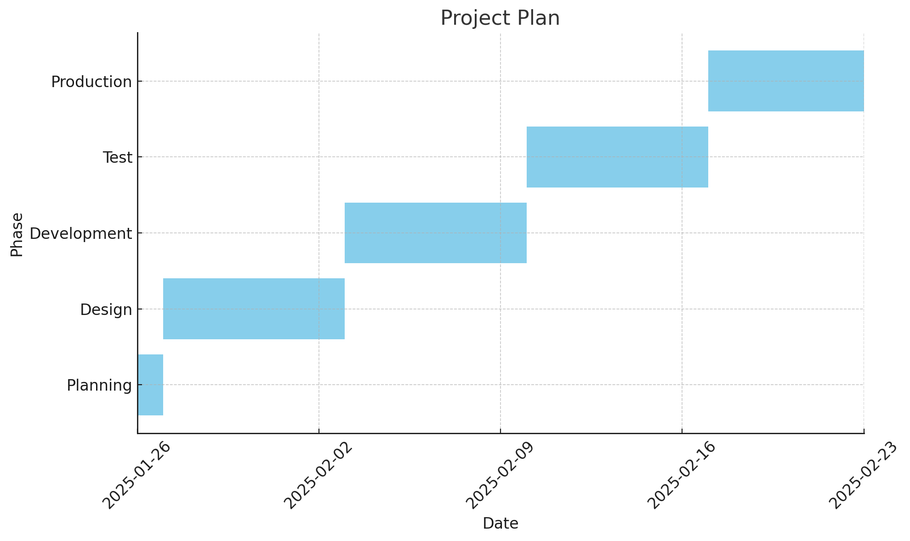

*Ref 1: Group project timeline outlining the planned planning, design, development, testing, and production phases.*

The team also created a context diagram showing the application's planned interactions with users, administrators, authentication services, notifications, and the database.

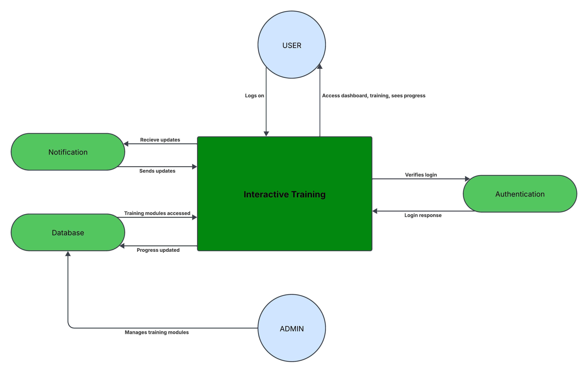

*Ref 2: Group context diagram illustrating major application components and their intended interactions.*

---

### 2. Application Design and User Navigation

During the design phase, I collaborated with the Development Lead to help establish an interface that would be easy for employees to understand and navigate.

The UI/UX work emphasized clear labels, recognizable icons, organized content, and consistent layouts.

The team documented how users would navigate between application features such as the dashboard, training modules, employee profiles, company resources, and notifications.

*Ref 3: Group application navigation diagram showing the planned relationships between screens and features.*

A separate process flow illustrated how users would access training content and how training progress would be handled.

*Ref 4: Training workflow diagram showing the proposed user journey from login through training access and progress tracking.*

The group also documented application components and their relationships through UML diagrams.

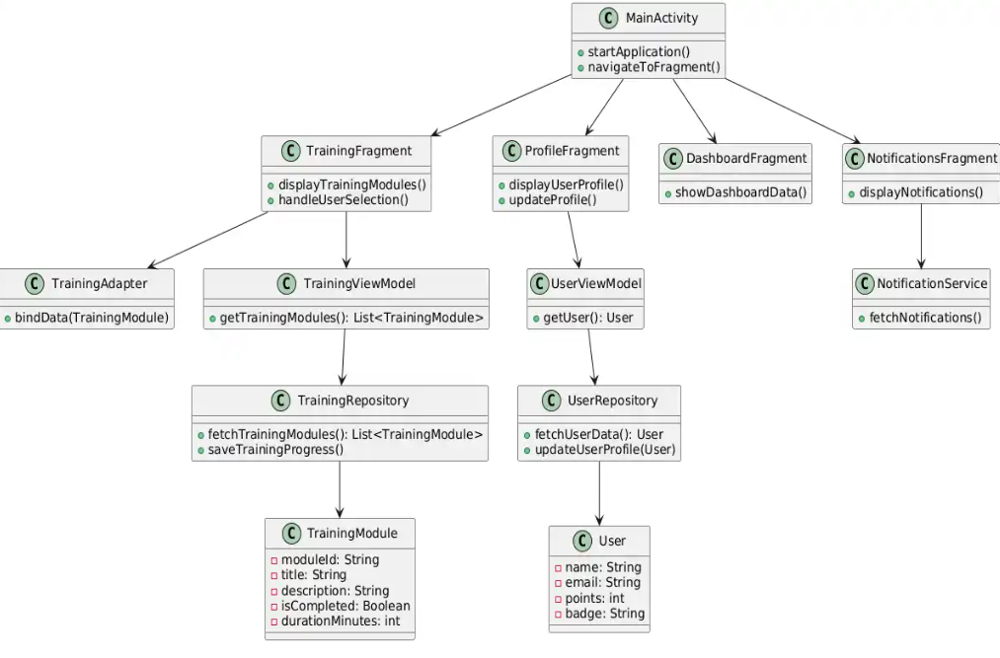

*Ref 5: Group UML class diagram modeling application components, fragments, view models, and repositories.*

---

### 3. User Interface Development

My primary responsibility was collaborating on the development and refinement of the application's user interface and user experience.

Using Android Studio, I worked alongside the Development Lead on screens supporting employee access, company information, and navigation.

#### Login Interface

The login screen provided the entry point for employees accessing the application.

The design emphasized straightforward input fields, clear labeling, and visible navigation options.

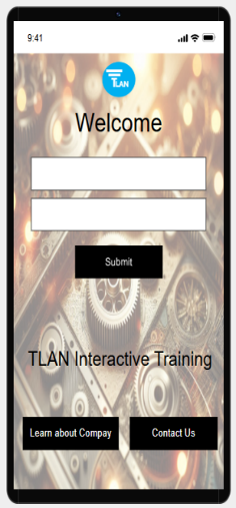

*Ref 6: Login interface developed as part of the Android application prototype.*

#### Company Information

The application included a company information screen presenting background information and organizational details.

*Ref 7: Company information screen included in the application.*

#### Company Resources and Navigation

The application also included a navigation interface linking users to company resources, contact options, the company website, and external services.

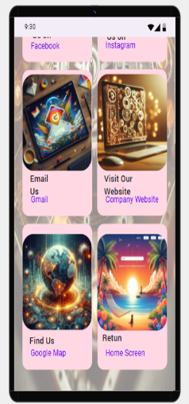

*Ref 8: Application interface providing access to company resources and external links.*

---

### 4. Employee Profiles, Training, and Notifications

The application's design included interfaces supporting employee training, individual profiles, course progression, and notifications.

#### Employee Profile and Training Interface

The employee-facing interface was designed to present training categories, enrolled courses, active courses, and completed courses.

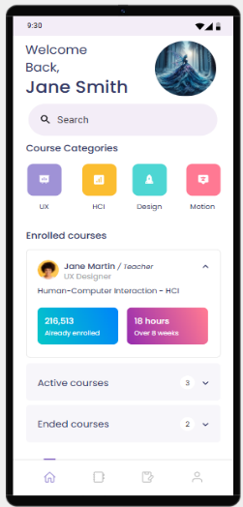

*Ref 9: Employee profile and training interface displaying course categories and progress-related information.*

#### Notifications Interface

The notifications screen was designed to present reminders, announcements, and training-related updates.

The interface emphasized clear message presentation and consistent navigation with other application screens.

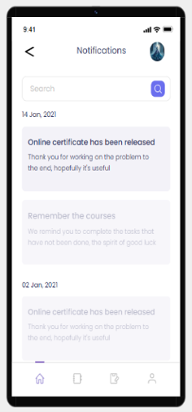

*Ref 10: Notification interface displaying example training reminders and employee updates.*

These interfaces demonstrated the team's focus on organizing training information into accessible, user-friendly application screens.

---

### 5. Application Architecture and Database Integration

The team developed an architecture connecting the Android application to back-end services and a MongoDB database.

The initial back-end approach relied on a local development environment, which presented collaboration and integration challenges.

The team subsequently worked on moving the database to MongoDB and connecting back-end services through Google Cloud.

These infrastructure and database tasks were primarily handled by other team members, while I participated in the broader development process and UI-related integration discussions.

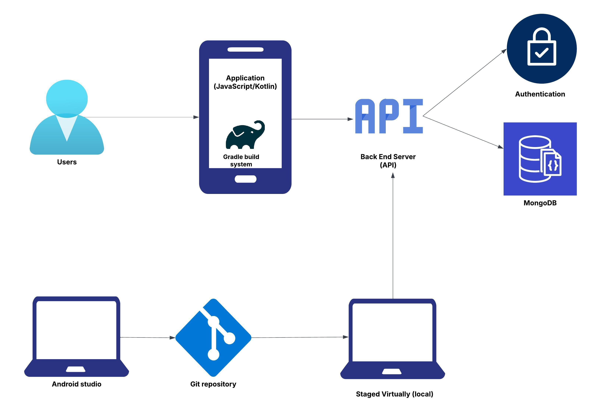

*Ref 11: Group infrastructure diagram illustrating the proposed relationships between the Android application, back-end services, authentication, and database.*

The team used MongoDB collections to support application data such as user profiles, training modules, notifications, and progress-related records.

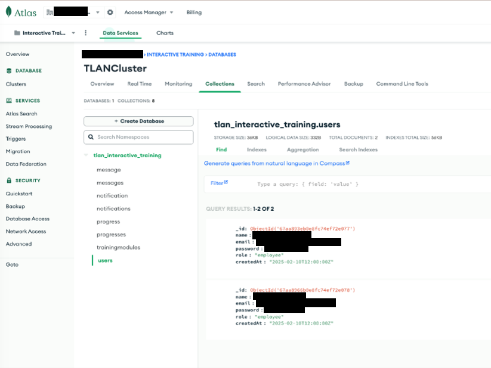

*Ref 12: Sanitized MongoDB Atlas screenshot showing application collections and example records used during development.*

A UML sequence diagram also documented the intended interactions between the user, application, authentication, training functionality, notification functionality, and database.

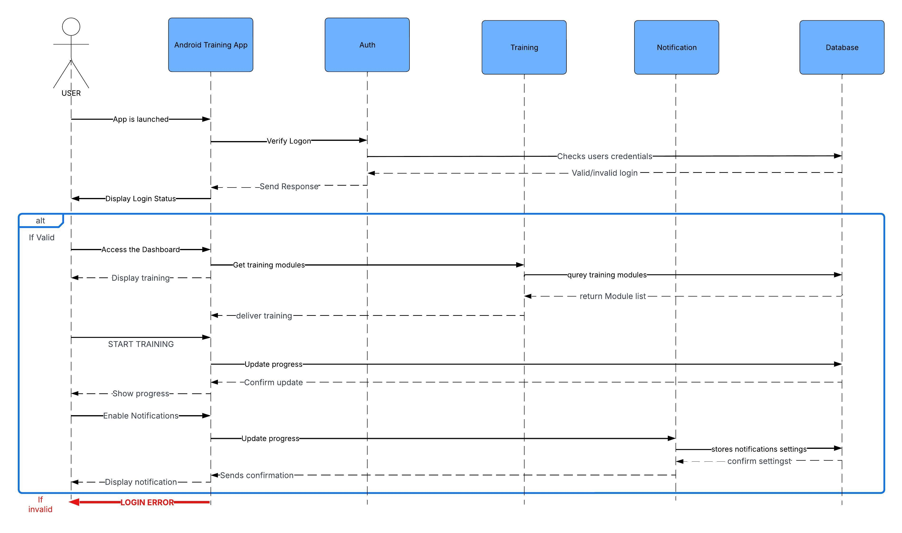

*Ref 13: Group sequence diagram modeling authentication, training access, progress updates, and notification interactions.*

---

### 6. Manual Testing and Troubleshooting

Testing was conducted primarily through manual reviews, application emulation, collaborative debugging, and iterative code changes rather than a fully automated testing framework.

I participated in development and testing discussions with the team, helping identify UI issues and address implementation challenges.

The project encountered several technical difficulties, including:

- Instability associated with the original local back-end environment.
- Challenges integrating the Android front end with back-end services.
- Authentication and third-party service integration limitations.
- UI inconsistencies and application navigation issues.
- Training progress and notification-related problems.

The team used collaborative troubleshooting, GitHub, Android Studio, and a structured improvement plan to prioritize and address issues during development.

This process reinforced the importance of validating requirements, documenting defects, coordinating changes, and distinguishing prototype functionality from production-ready features.

---

### 7. Team Collaboration and Development Documentation

Throughout the project, I helped maintain weekly team meeting documentation covering requirements, task assignments, technical challenges, testing discussions, and development progress.

Regular communication through Slack and Zoom supported collaboration among the project manager, development lead, assistant developers, tester, and UI/UX lead.

The team applied Agile and DevOps concepts to organize development tasks, review progress, and adapt to technical challenges.

The experience demonstrated the importance of effective communication, clear responsibilities, continuous feedback, and coordinated troubleshooting when developing software in a distributed team environment.

---

### 8. Final Prototype and Project Outcomes

The team completed an academic prototype demonstrating core application interfaces and training-related functionality.

The project provided hands-on experience across the software development lifecycle, including requirements gathering, interface design, collaborative development, integration, manual testing, and project documentation.

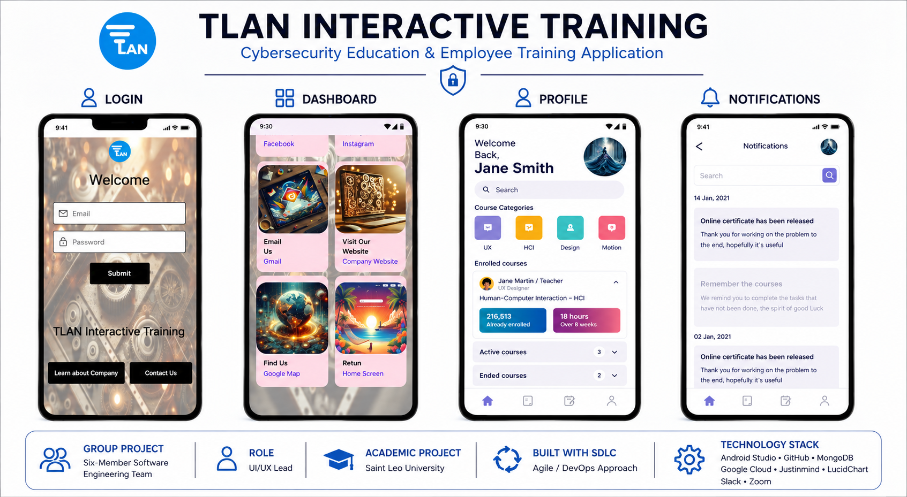

*Ref 14: Final project showcase presenting the application's login, company navigation, employee profile, and notification interfaces.*

The team's final report identified remaining limitations and future improvements, including expanded training content, additional third-party integrations, authentication refinements, performance monitoring, and a post-launch maintenance strategy.

The application was not released publicly through the Google Play Store during the course.

As the UI/UX Lead, this project strengthened my understanding of user-centered design, collaborative software development, manual testing, and the importance of aligning application interfaces with technical requirements and system functionality.
