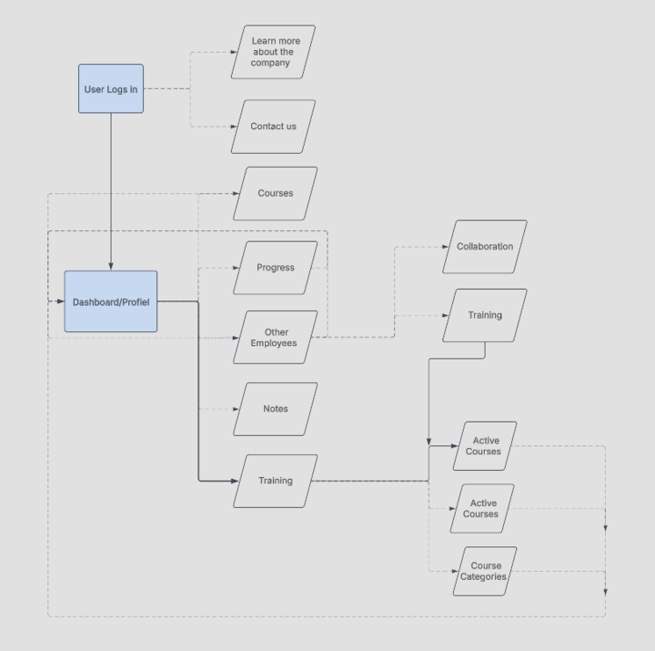
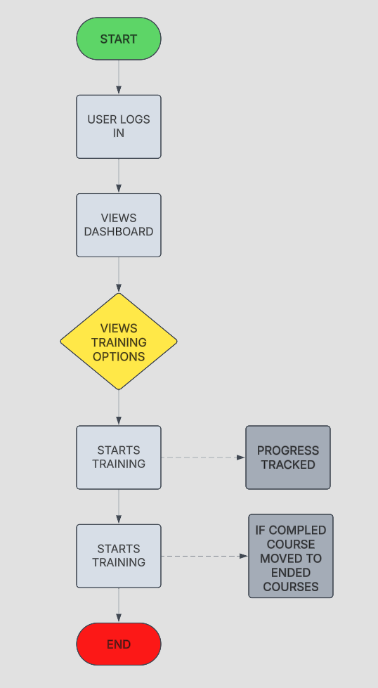

# TLAN Interactive Training Application

## Objective

TLAN Interactive Training was a six-person software engineering group project completed for COM-430 at Saint Leo University during January–March 2025. The team developed an Android training application for a fictional cybersecurity company, with requirements covering employee login, training access, progress tracking, notifications, and company communication. [S1–S3](EVIDENCE.md#source-register)

My role was **UI/UX Lead**. My contribution centered on interface design and usability, collaboration with the programmers, design review, and team documentation. The meeting notes also assigned me MongoDB document-entry support; that assignment does not establish ownership of backend development. Application programming, infrastructure, integration, and testing were shared across the team under separately assigned roles. [S1–S4](EVIDENCE.md#contribution-boundaries)

The final presentation describes an application running in an emulator and communicating with a live backend at the time of the project. This portfolio documents that academic prototype and its design process; a production release and a currently available service have not been verified. See the [evidence notes](EVIDENCE.md) for source locations, attribution, and unresolved limitations.

### Skills Learned

- Developed my understanding of UI/UX design for employee training, navigation, and progress visibility.
- Collaborated on interface decisions for login, training access, and notifications.
- Reviewed team diagrams to relate user-facing screens to application workflows.
- Organized meeting notes and communicated design and implementation issues across team roles.
- Learned how frontend usability depends on backend integration and consistent data models.
- Gained experience with requirements traceability, manual review, and iterative problem-solving through the team's development process.
- Reflected on communication, scope control, and the difference between a demonstrated prototype and deployment readiness.

These learning outcomes are supported by my reflection, meeting notes, the team's role assignments, and its testing documentation. They do not imply that I independently implemented every feature. [S1–S4](EVIDENCE.md#source-register)

### Tools Used

- **Slack and Zoom** — team communication, design discussion, and coordination documented in my reflection and meeting notes.
- **Android Studio and its emulator** — the team's Android development and demonstration environment.
- **GitHub** — the team's shared repository for application material, backend code, diagrams, and documentation.
- **Justinmind and LucidChart** — wireframing and diagramming tools listed in the team presentation; individual authorship of each exported diagram is not established.
- **MongoDB and Google Cloud** — the team's database and backend hosting technologies. My notes record assigned database support; backend engineering remains attributed to the team.
- **Node.js, Express, and Mongoose** — visible in the team's backend source and package manifest, included here as architecture context rather than a claim of my independent implementation.

Tool attribution: [S1–S3 and S5](EVIDENCE.md#source-register).

## Steps

### 1. Define the Training Workflow and Team Responsibilities

The team planned a training application for a fictional company that wanted employees to access courses and track learning. Requirements evolved through weekly discussions and included login, dashboard navigation, course status, and notifications. My UI/UX role focused on how employees would navigate these functions. [S1–S3](EVIDENCE.md#source-register)

*Ref 1: Team design artifact showing intended navigation between login, dashboard/profile, training, progress, notes, and employee collaboration. It records planned relationships, not proof that every branch was implemented. Source: S5, G2 App Design Chart.*

---

### 2. Review User Flow and Screen Relationships

The February 6 meeting notes assigned me review of diagrams supplied by the project manager. The training-flow diagram connects login and dashboard access to training selection, progress tracking, and completed-course organization. The original diagram includes repeated labels; it is preserved as a historical team artifact. [S2 and S5](EVIDENCE.md#source-register)

*Ref 2: Intended training journey from login to course completion. Diagram review is supported for my role; sole authorship of this diagram is not claimed.*

---

### 3. Document the Login and Company Navigation Interfaces

My reflection identifies login and navigation as UI/UX design concerns. The supplied login image shows two empty input fields, a submit control, and links to company information and contact options. The supplied image named “Dashboard” instead displays company/contact navigation, so it is described by its visible content here. [S3 and S6](EVIDENCE.md#source-register)

*Ref 3: Supplied login interface image. Empty fields expose no entered credentials. This image alone does not demonstrate successful authentication or password-storage security.*

*Ref 4: Supplied company/contact navigation screen with email, website, map, and return links. Visible social links do not establish completed social sign-in or published company social accounts.*

---

### 4. Present Training and Notification Interface Concepts

The profile image illustrates course categories, enrollment information, and active/ended course groupings. The notification image illustrates reminders and certificate messages. These supplied interface visuals help explain the intended experience; their displayed names, dates, course counts, and enrollment totals are not evidence of real users, measured adoption, or issued certifications. [S1 and S6](EVIDENCE.md#source-register)

*Ref 5: Supplied profile/training interface visual showing information hierarchy and course groupings. UI imagery is not an independently verified execution trace.*

*Ref 6: Supplied notifications interface visual showing reminder and certificate-message layouts. This does not verify automated delivery or real-time notification performance.*

---

### 5. Understand Frontend and Backend Integration

The team architecture connects the application to an API, authentication, and MongoDB. The final presentation reports connecting Google Cloud and MongoDB and demonstrating the app in an emulator. The repository contains an Express server that references user, training, progress, notification, and message routes. These are team implementation artifacts, not work attributed solely to me. [S1 and S5](EVIDENCE.md#source-register)

*Ref 7: Original team infrastructure design showing the application, API, authentication, database, and development environment. Technology labels are preserved as drawn; they are not a verified inventory of the final build.*

The database screenshot is excluded because it displays plaintext password values and personal account information. Its presence also prevents this portfolio from claiming that secure credential storage was demonstrated. The public repository lacks several local modules referenced by the server, so it is not presented as a complete, reproducibly runnable application. [Evidence and limitations](EVIDENCE.md#limitations-and-conflicting-evidence)

---

### 6. Track UI Issues and Participate in Iterative Review

The February 15 Version 1 test submission records UI symbol errors, type compatibility problems, and training-progress references. Its resolution plan assigns me UI-related issues, including `SwitchMaterial` compatibility, unresolved UI symbols, and UI refinement after backend fixes. These are documented responsibilities; the plan does not independently prove that I completed each fix. [S4](EVIDENCE.md#source-register)

The final presentation describes predominantly manual code review and collaborative debugging, including UI, notification, and progress-tracking issues. My reflection emphasizes communication and repeated validation as lessons from the project. No automated test coverage, performance benchmark, or production security certification is claimed. [S1 and S3](EVIDENCE.md#source-register)

---

### 7. Record Deployment Limitations and Lessons Learned

The final presentation's deployment and get-well sections identify remaining work: obtaining a Google Play developer account, establishing monitoring and a patching process, expanding training beyond three reported modules, and planning future updates. Facebook and Instagram sign-in are described as future features. Zoom API and Squarespace authentication difficulties are also documented. [S1, slides 7–8 and 16–18](EVIDENCE.md#source-register)

The presentation broadly reports meeting functional requirements, but the reviewed materials do not provide a complete final acceptance-test record. Likewise, targets in the meeting notes for concurrent users, response time, uptime, and backups are requirements rather than demonstrated results.

The strongest lessons from my reflection are the importance of communication, clear role boundaries, manageable scope, and repeated validation. This project gave me experience connecting UI/UX decisions with the wider software development lifecycle while working within a team. [S2–S3](EVIDENCE.md#source-register)

**Original team work:** [Group-2-Application repository](https://github.com/LorandGit/Group-2-Application). Diagrams are credited to the team. This folder contains portfolio documentation and selected visuals, with [source and review notes](EVIDENCE.md).
