# Digital Forensics Investigation

## Objective

The Digital Forensics Investigation was an academic computer forensics project completed for COM-452 at Saint Leo University.

The project involved examining three forensic image files associated with a simulated M57.biz corporate investigation using Autopsy 4.21.0. The objective was to identify, analyze, correlate, and document digital evidence related to suspected unauthorized disclosure of sensitive business information and financial extortion.

The investigation included case creation, chain-of-custody documentation, review of recorded MD5 hash values, examination of communications and file artifacts, analysis of supporting documents and activity logs, organization of evidence into investigative classes, and preparation of a formal forensic report.

### Skills Learned

- Created and managed a multi-source digital forensics case using Autopsy.
- Examined three forensic image files within a simulated corporate investigation.
- Documented chain-of-custody information for supplied evidence sources.
- Recorded image sizes, bad-sector counts, and documented MD5 hash values for the supplied evidence sources.
- Reviewed email, text, image, PDF, filesystem, and activity-log artifacts.
- Examined artifact metadata and timestamps to establish investigative context.
- Correlated communications and supporting artifacts across multiple forensic image sources.
- Organized evidence into classes based on investigative relevance.
- Distinguished primary evidence from supporting and unrelated artifacts.
- Evaluated image artifacts containing extracted information relevant to the investigation.
- Reviewed supporting material related to steganography and its potential relevance to the case.
- Documented forensic methodology, evidence, findings, conclusions, and exhibits in a formal investigation report.
- Strengthened investigative reasoning, evidence interpretation, and technical-reporting skills.

### Tools Used

- **Autopsy 4.21.0** for forensic image examination, metadata review, artifact analysis, and case organization.
- **The Sleuth Kit**, accessed through Autopsy, as the underlying digital forensics framework.

## Steps

### 1. Case Setup and Evidence Sources

Created an Autopsy case for the semester investigation and added three supplied forensic image sources associated with Charlie, Jo, and Terry.

The three images were examined separately while remaining part of the same overall investigation so that potentially related artifacts could be compared across evidence sources.

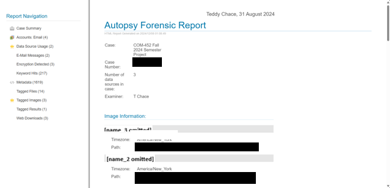

*Ref 1: Autopsy case environment containing the three forensic image sources examined during the investigation.*

---

### 2. Chain of Custody and Evidence Documentation

Documented chain-of-custody information for each forensic image, including evidence descriptions, image sizes, bad-sector counts, and recorded MD5 hash values.

The report documented these values as part of the evidence-handling process. The project does not claim that the hashes were independently recomputed outside of the documented case materials.

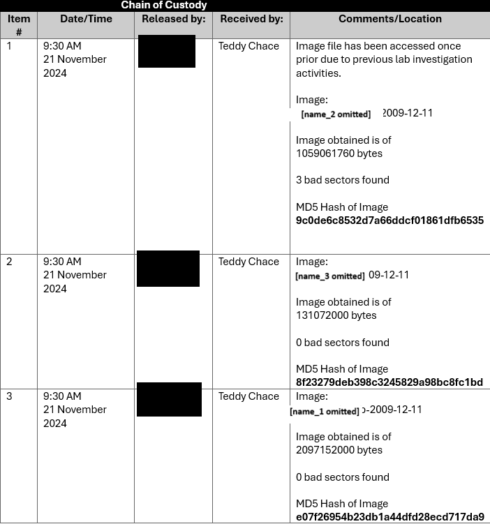

*Ref 2: Chain-of-custody and forensic-image information documented for the three evidence sources.*

---

### 3. Evidence Classification

Organized relevant findings into evidence classes to separate communications and supporting business records according to their investigative significance.

The report grouped evidence into categories involving communications between Charlie and external competitors as well as relevant M57.biz business logs.

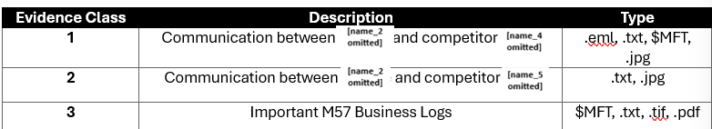

*Ref 3: Evidence classes used to organize collected artifacts by investigative relevance.*

---

### 4. Email Communication Analysis

Examined email artifacts associated with communications between Charlie and competitor Jamie.

The message content was reviewed together with associated Autopsy metadata to establish sender and recipient information, timestamps, message context, and the relationship of the communication to the investigation.

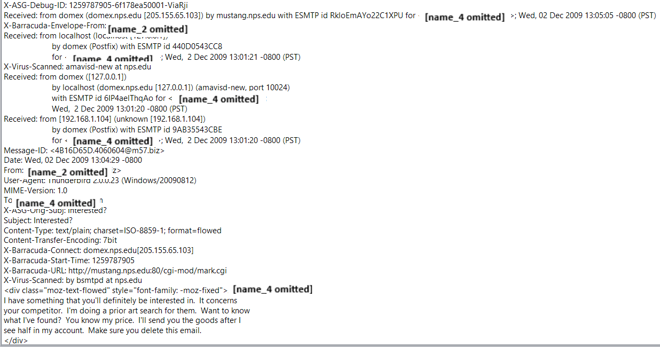

*Ref 4: Email content reviewed as part of the investigation into the suspected exchange of sensitive business information.*

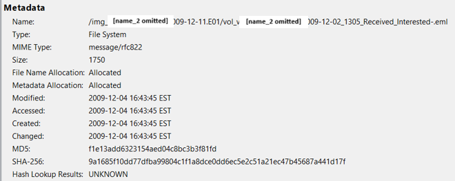

*Ref 5: Autopsy metadata associated with the examined email artifact.*

---

### 5. Extortion-Related Communication Analysis

Reviewed communication artifacts associated with Charlie and competitor Andy as part of the simulated financial-extortion investigation.

The message content was evaluated together with its metadata to understand the context, timing, and relevance of the communication to the investigative hypothesis.

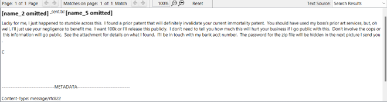

*Ref 6: Communication content examined during the simulated extortion investigation.*

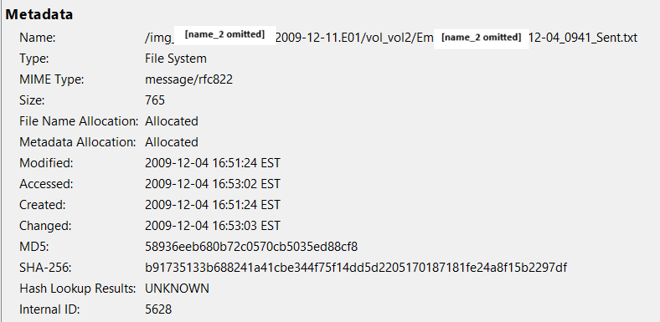

*Ref 7: Autopsy metadata associated with the extortion-related communication artifact.*

---

### 6. Image Artifact Analysis

Examined image files identified during the investigation and reviewed extracted information associated with those artifacts.

The report documented image artifacts containing information relevant to the suspected disclosure of sensitive business material and to the communication between the investigated parties.

*Ref 8: Image artifact and associated forensic information examined during the investigation.*

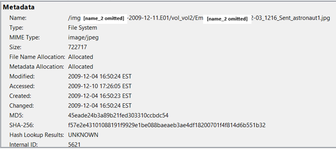

*Ref 9: Autopsy metadata associated with the image artifact.*

---

### 7. System and Activity Log Analysis

Reviewed activity logs located within Terry's forensic image to determine whether they contained information relevant to the central investigation.

The logs contained system and application activity associated with M57.biz. Although most of the reviewed material was not directly related to the primary allegations involving Charlie, the artifacts were still evaluated for potential investigative relevance.

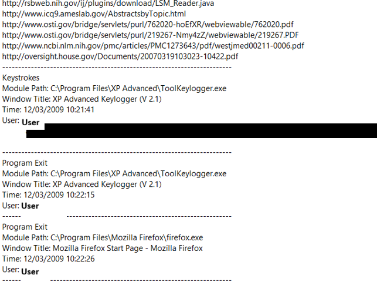

*Ref 10: First portion of the activity log reviewed during the investigation.*

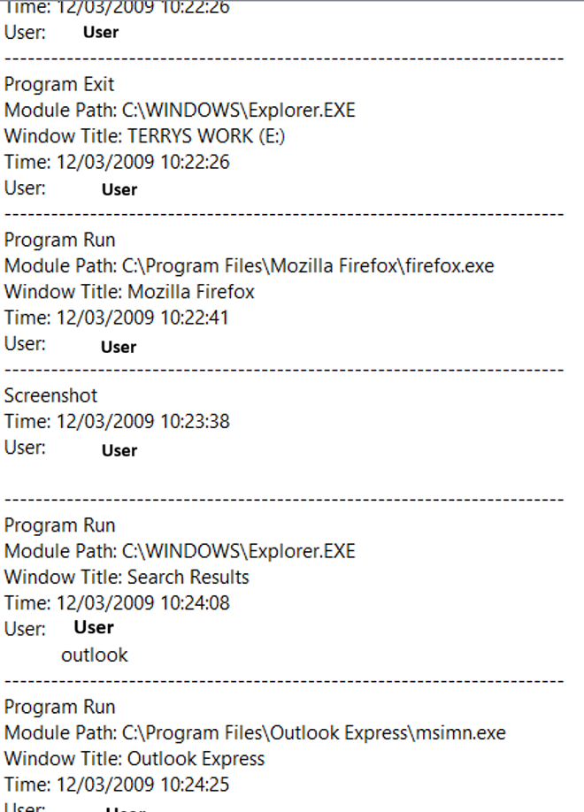

*Ref 11: Additional activity-log entries examined for potential relevance to the case.*

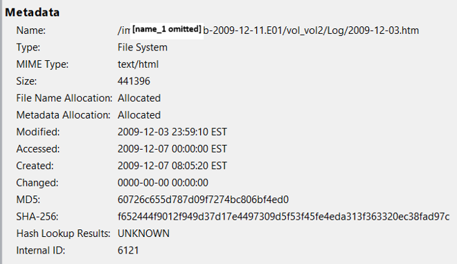

*Ref 12: Autopsy metadata associated with the reviewed activity-log artifact.*

---

### 8. Cross-Source Evidence Correlation

Compared findings across the three forensic image sources to determine whether artifacts from one source provided support or context for findings from another.

The Charlie image contained the majority of communications and image artifacts relevant to the central investigation. The Jo image contained supporting material related to steganography, including a PDF discussing the technique, while the Terry image primarily contained business and activity logs that were largely unrelated to the central allegations.

This stage reinforced the importance of separating direct evidence from contextual, supporting, and unrelated material during a forensic investigation.

---

### 9. Findings and Reporting

Organized the investigation results into a formal forensic report containing:

- Executive summary and case tasking
- Statement of compliance
- Tool documentation
- Chain-of-custody records
- Evidence classes
- Artifact exhibits
- Investigation objectives
- Forensic analysis methodology
- Relevant findings
- Conclusions and recommendations
- Supporting appendices

The final report documented the reasoning used to connect individual artifacts with the broader simulated investigation and presented supporting evidence through screenshots and exhibits.