# Exploring the Seven Domains of a Typical IT Infrastructure

## Objective

The Exploring the Seven Domains of a Typical IT Infrastructure Lab was an academic systems security exercise focused on examining security controls, connectivity, access restrictions, and infrastructure components across the seven domains of a typical IT environment.

The lab provided hands-on exposure to workstation security, access controls, local network behavior, firewall and routing configurations, WAN connectivity, remote access, Active Directory, Group Policy, and application services. The objective was to develop a broader understanding of how security controls and infrastructure components interact across an enterprise-style environment.

### Skills Learned

- Examined Windows workstation security and endpoint protection settings.
- Tested authorized and denied access to shared resources.
- Analyzed ARP tables and switch forwarding information to understand local network communication.
- Examined firewall, NAT, DMZ, and routing configurations using pfSense.
- Used traceroute to analyze network connectivity and routing paths.
- Performed reverse DNS lookup and examined remote-access network behavior.
- Reviewed Active Directory group membership and access-control concepts.
- Examined password policy settings through Group Policy Management.
- Verified Docker service operation and access to an OWASP Juice Shop web application.
- Applied concepts including least privilege, network segmentation, multifactor authentication, firewalling, and secure remote access across the seven infrastructure domains.

### Tools Used

- **Windows Security / Microsoft Defender** for examining workstation security and endpoint protection settings.
- **Windows Command Prompt** for ARP, traceroute, DNS, and network-related commands.
- **pfSense** for examining NAT, firewall, routing, and DMZ configurations.
- **Active Directory Users and Computers** for reviewing group membership.
- **Group Policy Management Console** for examining password policy settings.
- **Docker** for examining application service operation.
- **OWASP Juice Shop** as the web application used within the lab environment.

## Steps

### 1. Workstation Domain Security

Examined security controls applied to a Windows workstation, including endpoint protection and restrictions designed to prevent potentially unsafe activity.

Windows Virus & Threat Protection settings were reviewed to examine protections configured on the workstation.

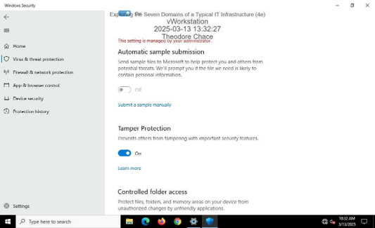

*Ref 1: Windows Virus & Threat Protection settings used to examine workstation security controls.*

The lab also demonstrated application protection by attempting to execute a restricted executable file and observing the resulting security warning.

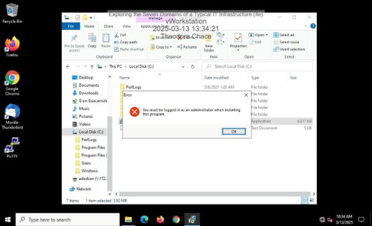

*Ref 2: Security warning displayed when attempting to execute a restricted file.*

---

### 2. Access Control and File Permissions

Tested access to network resources to observe how permissions determine whether a user can access shared files and folders.

A connection to an authorized user folder succeeded when the account had the appropriate permissions.

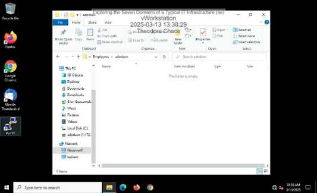

*Ref 3: Successful connection to a network resource for which the user had authorized access.*

An attempt to access another user's restricted folder was denied.

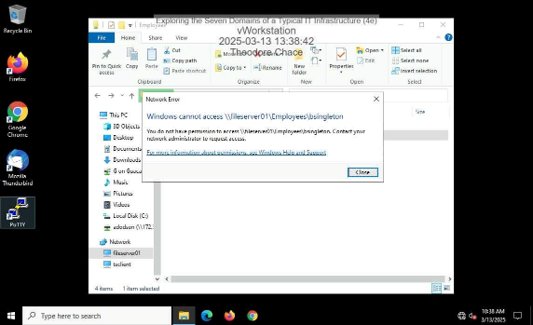

*Ref 4: Access denied when attempting to connect to a restricted network resource.*

Together, these tests demonstrated how permissions can enforce access restrictions between users and organizational resources.

---

### 3. LAN Domain Analysis

Examined local network behavior using ARP information and switch forwarding data.

The workstation's original ARP table was reviewed before additional network activity.

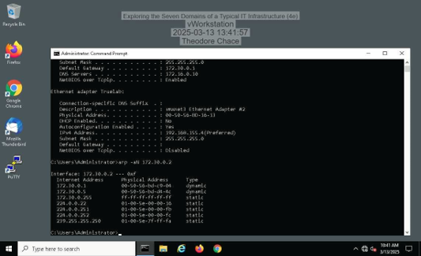

*Ref 5: Original ARP table showing IP-to-MAC address mappings known by the workstation.*

After additional network communication, the ARP table was examined again to identify newly learned network information.

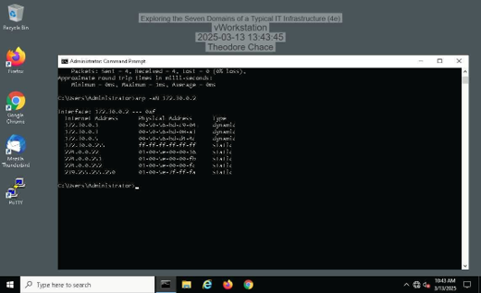

*Ref 6: Updated ARP table showing additional network information learned during the exercise.*

The switch forwarding table was also reviewed to examine how a Layer 2 network device tracks connected systems.

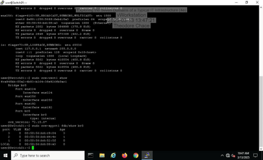

*Ref 7: Switch forwarding table displaying learned network entries.*

---

### 4. LAN-to-WAN Security

Used pfSense to examine controls governing traffic between internal and external or segmented networks.

Outbound Network Address Translation (NAT) settings were reviewed to examine how internal network traffic was translated when communicating outside the local network.

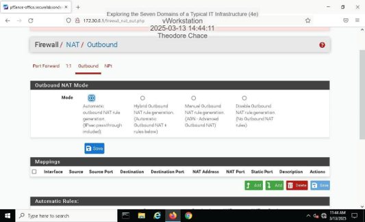

*Ref 8: pfSense outbound NAT configuration used within the lab environment.*

Firewall rules for the DMZ were also examined to understand how traffic to and from a segmented network could be controlled.

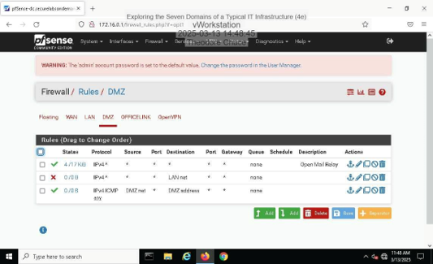

*Ref 9: pfSense firewall rules controlling traffic within the DMZ.*

---

### 5. WAN Connectivity and Routing

Used traceroute to examine the path network traffic followed between systems.

The results provided visibility into the intermediate network hops used to reach a destination and reinforced how routing decisions affect communication across networks.

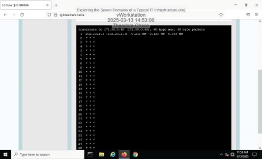

*Ref 10: Traceroute results used to examine the network path between systems.*

---

### 6. Remote Access and DNS

Examined remote-access behavior and name resolution within the lab environment.

A reverse DNS lookup was performed to resolve an internal IP address back to its associated host information.

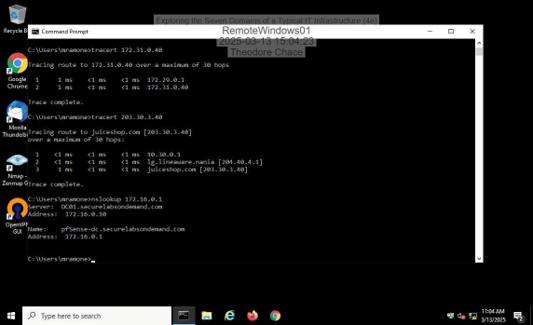

*Ref 11: Successful reverse DNS lookup performed against an internal system.*

The lab also used traceroute results to determine that the tested VPN connection used **split tunneling**. External traffic followed a different gateway path than traffic intended for the internal network.

---

### 7. Active Directory and Access Management

Examined identity and access-management components within a Windows domain environment.

Active Directory Users and Computers was used to review membership within the Developers group.

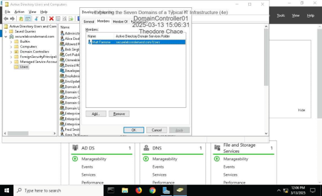

*Ref 12: Active Directory interface displaying membership of the Developers group.*

This portion of the lab reinforced how users and groups can be used to organize accounts and support role-based access to resources.

---

### 8. Group Policy and Password Security

Reviewed domain password requirements through the Group Policy Management Console.

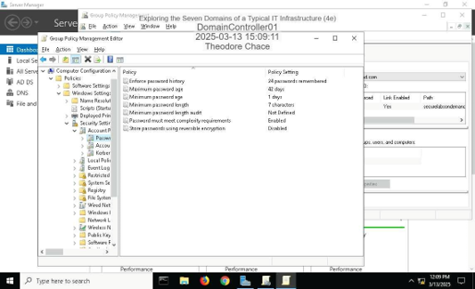

*Ref 13: Password policy settings displayed through Group Policy Management.*

This demonstrated how centralized policies can be used to enforce account-security requirements across systems within a Windows domain.

---

### 9. Application Services

Examined application infrastructure used within the lab environment.

The Docker service status was reviewed to verify that the container platform used by the environment was operational.

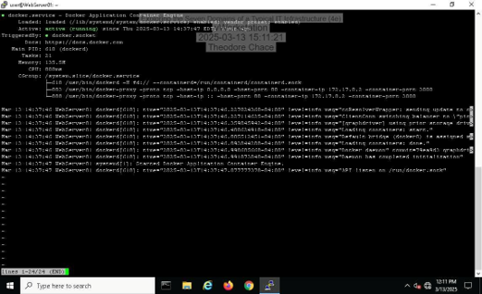

*Ref 14: Docker service status displayed within the lab environment.*

An OWASP Juice Shop web application running within the environment was then accessed to verify the application service.

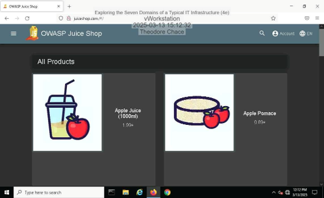

*Ref 15: OWASP Juice Shop web application running within the lab environment.*

---

### 10. Security Controls Across the Seven Domains

The final portion of the lab examined threats and security controls across the User, Workstation, LAN, LAN-to-WAN, WAN, Remote Access, and System/Application domains.

The exercise reinforced the importance of defense-in-depth through controls such as:

- Principle of least privilege
- Security awareness training
- Multifactor authentication
- Network segmentation
- Firewall controls
- Network monitoring
- VPN-based remote access
- Centralized security policies
