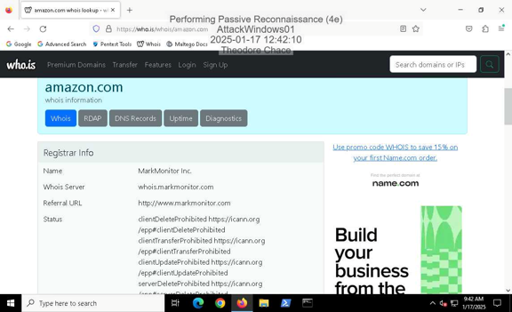
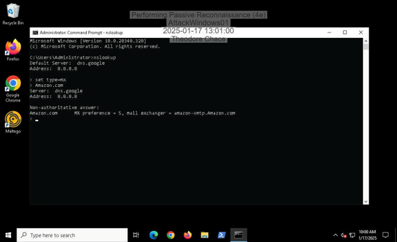
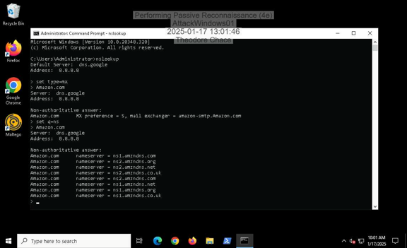
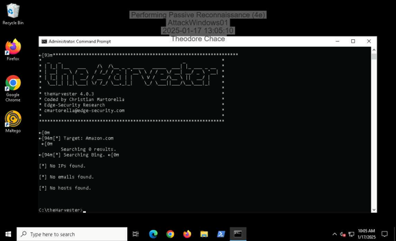
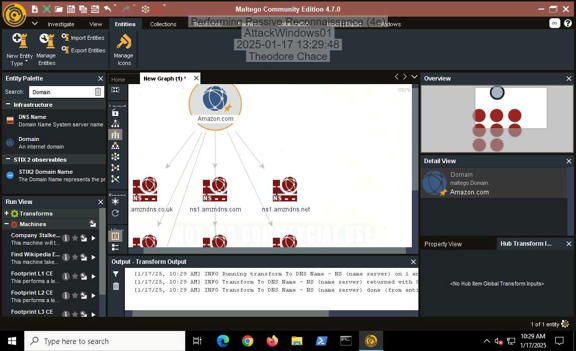
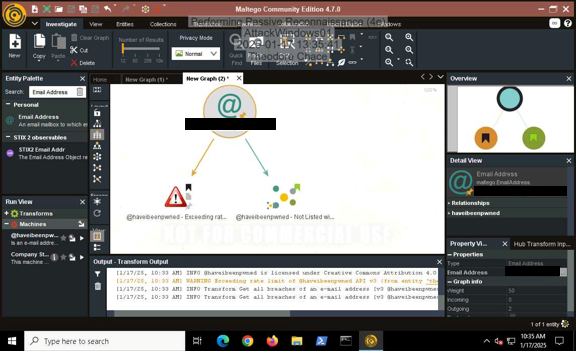
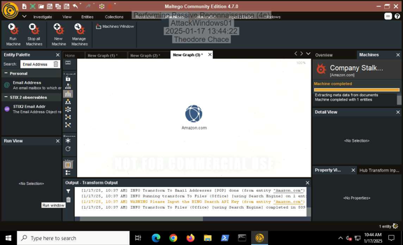
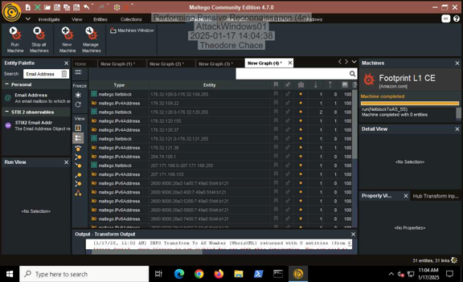

# Performing Passive Reconnaissance Lab

## Objective

The Performing Passive Reconnaissance Lab was an academic cybersecurity exercise focused on gathering and analyzing publicly available information without directly interacting with target systems.

The lab explored several passive reconnaissance techniques, including advanced search operators, WHOIS research, DNS record queries, theHarvester, and Maltego. The objective was to develop a better understanding of how publicly accessible information can reveal details about domains, infrastructure, organizational relationships, and other information relevant to authorized security assessments.

### Skills Learned

- Developed an understanding of passive reconnaissance and open-source intelligence (OSINT).
- Practiced using advanced search operators to locate publicly indexed information.
- Performed domain-registration research using WHOIS.
- Queried DNS MX and NS records to examine publicly available infrastructure.
- Used theHarvester to collect publicly available domain-related information.
- Used Maltego to visualize relationships between domains, DNS records, email addresses, and IP addresses.
- Examined how publicly exposed information can contribute to an organization's external attack surface.
- Documented reconnaissance activities and interpreted collected information.

### Tools Used

- **Google Advanced Search Operators** for locating publicly indexed information.
- **WHOIS** for reviewing domain-registration information.
- **nslookup** for querying MX and NS DNS records.
- **theHarvester** for passive information gathering from supported public sources.
- **Maltego Community Edition** for visualizing relationships between publicly available entities and infrastructure.

## Steps

### 1. Search Engine Reconnaissance

Used advanced Google search operators to examine how different queries can narrow publicly indexed information associated with a domain.

The `site:` operator was used to restrict results to pages associated with a specific domain.

*Ref 1: Google `site:` search used to examine indexed pages associated with the selected domain.*

The `inurl:` operator was also used to identify search results containing the target term within URLs.

*Ref 2: Google `inurl:` search used to further explore publicly indexed domain information.*

---

### 2. WHOIS Domain Research

Performed a WHOIS lookup against Amazon.com to review publicly available domain-registration information.

The exercise demonstrated how WHOIS information can provide useful context about a domain's registration and administrative infrastructure during passive reconnaissance.

*Ref 3: WHOIS lookup displaying publicly available registration information for the target domain.*

---

### 3. DNS Mail Exchange Enumeration

Used `nslookup` to query Mail Exchange (MX) records for the target domain.

MX records identify infrastructure associated with receiving email for a domain and can provide additional information about an organization's publicly visible environment.

*Ref 4: MX record query performed using nslookup.*

---

### 4. DNS Name Server Enumeration

Used `nslookup` to query Name Server (NS) records associated with the target domain.

NS records identify authoritative name servers and provide additional visibility into publicly available DNS infrastructure.

*Ref 5: NS record query identifying authoritative name servers associated with the target domain.*

---

### 5. Passive Reconnaissance with theHarvester

Used theHarvester to practice collecting publicly available information associated with Amazon.com.

A search was first performed using Bing as the configured search source.

*Ref 6: theHarvester performing passive information gathering using Bing.*

A second search was performed using DuckDuckGo to compare results from another supported search source.

*Ref 7: theHarvester performing passive information gathering using DuckDuckGo.*

---

### 6. DNS Relationship Mapping with Maltego

Used Maltego Community Edition to visualize Name Server relationships associated with Amazon.com.

This demonstrated how passive reconnaissance data can be represented graphically to make relationships between entities easier to examine.

*Ref 8: Maltego graph displaying Name Server relationships associated with the target domain.*

---

### 7. Breach-Related OSINT with Maltego

Explored Maltego's Have I Been Pwned transform as part of the lab to examine how publicly available breach-related information can be incorporated into an OSINT investigation.

*Ref 9: Maltego results from a Have I Been Pwned transform performed during the academic exercise.*

---

### 8. Email Address Reconnaissance with Maltego

Used Maltego to examine email-address information associated with the selected target domain.

This portion of the lab demonstrated how email-related entities can be incorporated into passive reconnaissance and visualized alongside other publicly available information.

*Ref 10: Maltego used to examine email-address information associated with the target domain.*

---

### 9. Domain and IP Infrastructure Analysis

Used Maltego to examine publicly available IP-address and domain-name relationships associated with the target organization.

The results demonstrated how infrastructure information collected during passive reconnaissance can be organized for further analysis.

*Ref 11: Maltego results displaying domain-name and IP-address relationships associated with the target organization.*
